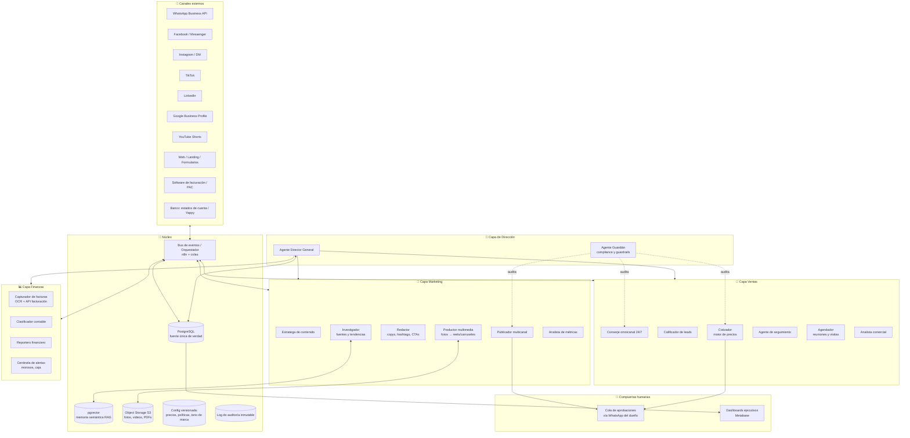

# 02 — Arquitectura del ecosistema

## 1. Visión general

El sistema es una **arquitectura de agentes orientada a eventos** con cuatro capas sobre una columna vertebral común de datos y orquestación.



---

## 2. Roster completo de agentes

Cada agente es un proceso con: (a) un prompt de sistema con su rol y políticas, (b) herramientas específicas (APIs, consultas SQL, funciones), (c) acceso de lectura/escritura limitado a su dominio, (d) presupuesto de tokens y de acciones por día.

### Capa de Dirección

| Agente | Misión | Dispara | Modelo sugerido |
|--------|--------|---------|-----------------|
| **Director General (DG)** | Supervisa KPIs de todas las áreas, detecta oportunidades/problemas, prioriza, asigna trabajo (crea tareas para otros agentes), responde preguntas estratégicas del dueño, genera briefing semanal | Cron diario 6:00, semanal lunes, y bajo demanda por chat | Modelo top (Opus/Fable) |
| **Guardián (compliance)** | Revisa salidas antes de tocar el mundo exterior: contenido sin fuentes inventadas, sin promesas prohibidas, precios = tabla oficial, datos personales no expuestos | Interceptor en cada publicación/cotización/mensaje saliente masivo | Modelo medio (Sonnet) |

### Capa Marketing

| Agente | Misión |
|--------|--------|
| **Estratega de contenido** | Mantiene el calendario editorial (mínimo 1 post/día), balancea pilares de contenido (trabajos reales 40%, educativo 30%, autoridad 20%, interactivo 10%), decide qué formato va a qué red |
| **Investigador** | Cuando no hay material del cliente: busca estadísticas verificables, estudios del sector, normativa aplicable y tendencias; entrega fichas con cita y URL de fuente; nada sin fuente entra al pipeline |
| **Redactor** | Genera títulos, descripciones, hashtags por red, CTAs, textos de historias y de anuncios, adaptados al tono de marca configurado y al formato de cada plataforma |
| **Productor multimedia** | Clasifica material entrante (foto/video, qué trabajo, calidad), mejora (ruido, iluminación, encuadre), genera variantes, ensambla reels/shorts/historias/carruseles/miniaturas/videos explicativos con plantillas de marca |
| **Publicador** | Programa y publica en FB, IG, TikTok, LinkedIn, GBP y YouTube Shorts; maneja reintentos, límites de API y la cola de aprobación |
| **Analista de métricas** | Recolecta alcance, interacción, clics y leads por publicación; identifica patrones ganadores (formato, hora, tema, gancho) y retroalimenta al Estratega con instrucciones concretas |

### Capa Ventas

| Agente | Misión |
|--------|--------|
| **Conserje omnicanal** | Primera respuesta < 60 s en WhatsApp, Messenger, IG DM y formularios; responde FAQs desde la base de conocimiento; conversa como vendedor profesional con el tono configurado |
| **Calificador** | Extrae de la conversación: necesidad, presupuesto, urgencia, autoridad (BANT adaptado); asigna score y etapa; detecta intención de compra y oportunidades de upsell/cross-sell |
| **Cotizador** | Motor de precios configurable (venta completa, abono inicial, pago parcial, financiamiento, visita técnica USD 25); calcula ITBMS, costos, margen y utilidad estimada; genera PDF con marca; aplica solo descuentos dentro de política |
| **Seguimiento** | Secuencias D+1/D+3/D+7/D+14 post-cotización con plantillas aprobadas; detecta respuestas y re-engancha; nunca más de N toques sin respuesta (configurable, anti-spam) |
| **Agendador** | Propone horarios según calendario real, agenda reuniones y visitas técnicas, envía recordatorios y reagenda |
| **Analista comercial** | Reportes diario/semanal/mensual: tasa de cierre, conversión por canal, tiempo promedio de venta, valor promedio de cliente, embudo completo |

### Capa Finanzas

| Agente | Misión |
|--------|--------|
| **Capturador** | Lee facturas emitidas (API del software de facturación/PAC) y recibidas (correo, foto, PDF → OCR); extrae RUC, fecha, ítems, ITBMS, totales |
| **Clasificador contable** | Asigna cada movimiento a un plan de cuentas configurado; aprende de correcciones; las excepciones van a cola de revisión |
| **Reportero financiero** | Construye estado de resultados, flujo de caja (real y proyectado), balance general, indicadores (utilidad bruta/operativa/neta, márgenes, DSO, runway) y borradores tributarios (ITBMS mensual, renta) |
| **Centinela** | Alertas proactivas: facturas por cobrar vencidas, clientes morosos, caída de ingresos vs. promedio móvil, proyección de caja < umbral, gastos atípicos |

---

## 3. Modelo de datos (núcleo)

PostgreSQL, esquema multi-tenant. Tablas principales:

```
contacts(id, tenant_id, nombre, telefono, email, canal_origen, consentimiento_at, ...)
conversations(id, contact_id, canal, estado, asignado_a)            -- hilo omnicanal
messages(id, conversation_id, direccion, contenido, agente, ts)     -- historial completo
leads(id, contact_id, score, etapa, necesidad, presupuesto, fuente_campaña)
quotes(id, lead_id, items_json, subtotal, itbms, total, costo, margen, estado, pdf_url)
deals(id, lead_id, valor, estado, cerrado_at, motivo_perdida)
appointments(id, lead_id, tipo[reunion|visita_tecnica], fecha, estado)
price_list(id, servicio, precio, costo_estimado, modalidades_json, vigente_desde)  -- versionada
discount_policy(id, regla, max_pct, requiere_aprobacion)
assets(id, tipo[foto|video], proyecto, etiquetas_json, url_original, url_mejorada, calidad_score)
content_items(id, pilar, formato, redes_destino, copy_json, asset_ids, fuentes_json, estado, scheduled_at)
publications(id, content_id, red, post_id_externo, published_at)
metrics_social(id, publication_id, alcance, impresiones, interacciones, clics, leads_atribuidos, captured_at)
invoices_issued(id, numero, cliente, fecha, items_json, itbms, total, estado_cobro, vence_at)
invoices_received(id, proveedor, fecha, items_json, itbms, total, categoria, pagada)
ledger_entries(id, fecha, cuenta, debe, haber, ref_tipo, ref_id)    -- contabilidad derivada
chart_of_accounts(codigo, nombre, tipo)
agent_tasks(id, agente, tipo, payload_json, estado, prioridad, creado_por)
approvals(id, tipo, payload_json, solicitado_por, estado, decidido_por, decidido_at)
audit_log(id, agente, accion, entidad, payload_hash, costo_tokens, ts)  -- append-only
events(id, tipo, payload_json, ts, procesado)                        -- bus persistente
```

Complementos:
- **pgvector** sobre `messages`, `content_items` y base de conocimiento (FAQs, fichas de investigación) para memoria semántica/RAG.
- **Object storage S3-compatible** (Cloudflare R2 / Backblaze B2 / S3) para fotos, videos, PDFs de cotizaciones y facturas — con versionado activado.

---

## 4. Orquestación y patrón de ejecución

- **Bus de eventos:** cada hecho (mensaje entrante, asset subido, factura recibida, post publicado, hora del día) inserta un evento. n8n (self-hosted) actúa de router/orquestador: escucha webhooks, encola, llama agentes, maneja reintentos con backoff.
- **Agentes:** funciones serverless o workers (Node/Python) que invocan Claude API con su prompt de rol + herramientas (tool use). Tareas largas (Director, producción de video) corren como jobs con estado en `agent_tasks`. En el nivel empresarial, los agentes se implementan con **Claude Agent SDK** (sub-agentes, memoria, MCP) en lugar de prompts sueltos.
- **Escalonamiento de modelos:** Haiku para clasificar/extraer (barato, rápido), Sonnet para conversar/redactar, modelo top solo para el Director y el Guardián en decisiones de alto impacto. Esto reduce el costo de tokens 60–80% sin perder calidad donde importa.
- **Cola de aprobaciones:** las acciones que requieren humano crean un registro en `approvals` y envían un WhatsApp al dueño con botones (✅ aprobar / ✏️ editar / ❌ rechazar). Sin respuesta en N horas: regla configurable (publicar igual el contenido de bajo riesgo; retener cotizaciones).

---

## 5. Infraestructura

| Componente | MVP | Profesional | Empresarial |
|-----------|-----|-------------|-------------|
| Cómputo | 1 VPS 4 vCPU/8 GB (Hetzner/DigitalOcean) con Docker Compose: n8n, Chatwoot, Postgres, Metabase | 2 VPS o Kubernetes ligero (k3s); workers separados de la BD; Postgres gestionado (Supabase/Neon/RDS) | Cloud gestionado (AWS/GCP), colas (SQS/PubSub), autoscaling de workers, entornos dev/staging/prod |
| Base de datos | Postgres en el VPS + backups diarios | Postgres gestionado con réplicas y PITR | Postgres gestionado + warehouse analítico (BigQuery/ClickHouse) |
| Almacenamiento media | Cloudflare R2 (sin costo de egreso) | R2 + CDN | S3 + CloudFront + políticas de ciclo de vida |
| Observabilidad | Logs de n8n + alertas a WhatsApp | Grafana/Loki o Better Stack; alertas de salud | APM completo, trazas por agente, presupuesto de tokens por agente con corte automático |

---

## 6. Seguridad y control de acceso

1. **Secretos:** todos los tokens de APIs (Meta, TikTok, Claude, PAC) en un gestor de secretos (Vault, Doppler, o variables cifradas), nunca en código ni en la BD. Rotación trimestral.
2. **Mínimo privilegio por agente:** cada agente tiene credenciales de BD con permisos solo a sus tablas (el Publicador no puede leer facturas; el Capturador no puede escribir en contenido). Esto contiene tanto bugs como inyecciones de prompt.
3. **Defensa contra inyección de prompt:** todo texto que viene del exterior (mensajes de clientes, resultados de búsqueda web, correos) se trata como datos no confiables: se delimita, no puede invocar herramientas privilegiadas, y el Guardián revisa acciones de riesgo originadas en contenido externo.
4. **Acceso humano:** dashboard y paneles tras SSO (Google Workspace) con 2FA; roles: dueño (todo), contador (finanzas, lectura), asistente (aprobaciones de contenido).
5. **Datos personales (Ley 81):** cifrado en reposo y tránsito, campo `consentimiento_at` obligatorio antes de mensajes de marketing, proceso de borrado a solicitud (derecho de cancelación), retención definida (ej. 5 años por requisitos fiscales para facturas; 24 meses para conversaciones de leads no convertidos).
6. **Auditoría:** `audit_log` append-only: qué agente hizo qué, con qué entrada, costo y resultado. Imprescindible para depurar y para confiar.

---

## 7. Respaldo y continuidad

- **BD:** backup automático diario + retención 30 días + prueba de restauración mensual (automatizada: restaurar a instancia efímera y validar conteos).
- **Media:** versionado en object storage + replicación a segundo proveedor en nivel profesional+.
- **Configuración:** precios, políticas, prompts y flujos de n8n versionados en este repositorio Git — el sistema entero es reconstruible desde Git + backups.
- **Plan de degradación:** si Meta/TikTok caen → la cola retiene y reintenta; si el LLM cae → el conserje responde con mensaje de espera y notifica al dueño; si el VPS cae → restauración documentada < 4 h (RTO) con pérdida máxima de 24 h (RPO) en MVP, < 1 h / < 15 min en profesional.

---

## 8. Escalabilidad

- Multi-tenant por diseño (`tenant_id`): segunda marca o sucursal = nueva fila de configuración.
- Los agentes son stateless (el estado vive en la BD): escalar = más workers.
- El bus de eventos desacopla productores de consumidores: agregar un agente nuevo (ej. RRHH, compras) no toca los existentes.
- Límites de plataforma (posts/día, mensajes/seg de WhatsApp) se gestionan con rate-limiters por canal en el Publicador y el Conserje.
