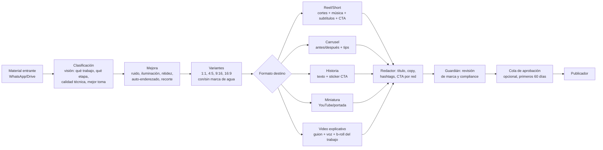

# 03 — Área 1: Marketing Autónomo

Objetivo: presencia diaria, consistente y medible en Facebook, Instagram, TikTok, LinkedIn, Google Business Profile, YouTube Shorts y WhatsApp Business, alimentada por (a) tu material real de trabajos y (b) contenido educativo investigado con fuentes cuando no hay material nuevo.

---

## 1. Pilares y calendario editorial

El **Estratega de contenido** mantiene un calendario rodante de 14 días con esta mezcla configurable:

| Pilar | % | Ejemplos | Fuente |
|-------|---|----------|--------|
| Trabajos reales (prueba social) | 40% | Antes/después, time-lapse de instalación, testimonio | Material del dueño |
| Educativo | 30% | "Cómo elegir X", errores comunes, mantenimiento | Investigador (con fuentes) |
| Autoridad | 20% | Normativa aplicable, estadísticas del sector, tendencias | Investigador (con fuentes) |
| Interactivo | 10% | Encuestas, preguntas, quiz, "adivina el costo" | Redactor |

Reglas del calendario:
- **Mínimo 1 contenido/día** en al menos 3 redes (configurable por red: p. ej., LinkedIn 3×/semana, IG/FB/TikTok diario, GBP 2×/semana, Shorts 3×/semana).
- Buffer mínimo de 7 días siempre lleno; si baja de 7, el Estratega dispara producción de contenido educativo automáticamente.
- Cada ítem define: pilar, formato, redes destino, horario óptimo (lo fija el Analista según datos propios, no "mejores horas" genéricas).
- Fechas clave de Panamá pre-cargadas (fiestas patrias de noviembre, carnavales, día de la madre 8-dic, temporada seca/lluviosa si el rubro lo amerita).

---

## 2. Pipeline multimedia: de tu foto al post publicado

Cuando envías fotos/videos por WhatsApp (o carpeta de Drive), el **Productor multimedia** ejecuta:

Detalles técnicos por etapa:

1. **Clasificación (visión):** un modelo multimodal etiqueta cada asset: tipo de trabajo, etapa (antes/durante/después), personas visibles (⚠️ si hay rostros de terceros → requiere consentimiento o difuminado, Ley 81), calidad (descarta borrosas), y selecciona las mejores N tomas.
2. **Mejora:** pipeline determinista (no generativo) primero: denoise, balance de blancos, exposición, enderezado, recorte por regla de tercios. Herramientas: APIs de edición (Adobe Firefly Services / Cloudinary AI / Topaz CLI en el VPS) o ffmpeg+ESRGAN self-hosted en MVP. La IA generativa solo para limpieza de fondo y expansión de encuadre — **nunca para alterar el trabajo mostrado**.
3. **Ensamblado de video:** plantillas de marca parametrizadas (logo, colores, tipografía) en un motor de render por API: **Creatomate**, **Shotstack** o **Remotion** (self-hosted, gratis). Entrada: clips seleccionados + guion del Redactor; salida: reel 9:16 con subtítulos quemados (clave: 85%+ se ve sin audio), short, y versión 1:1.
4. **Voz y guion:** para videos explicativos, guion del Redactor + TTS natural en español latino (ElevenLabs / Azure TTS) o avatar (HeyGen) en nivel profesional+.
5. **Miniaturas:** plantilla con texto grande (4–6 palabras), imagen del trabajo, branding.

---

## 3. Generación de contenido sin material nuevo

El **Investigador** trabaja con una regla inquebrantable: *nada sin fuente verificable entra al pipeline*.

Flujo:
1. El Estratega pide: "necesito 3 piezas educativas del pilar autoridad para la próxima semana".
2. El Investigador busca en fuentes priorizadas: organismos oficiales de Panamá (DGI, MICI, ACODECO, Contraloría/INEC para estadísticas), normas técnicas del rubro, estudios de gremios y consultoras reconocidas, tendencias (Google Trends, informes sectoriales).
3. Produce **fichas**: afirmación + cita textual + URL + fecha de consulta. Las fichas se guardan en la base de conocimiento (pgvector) y son reutilizables.
4. El Redactor convierte fichas en piezas: carrusel educativo, video con datos, post de autoridad — **siempre citando la fuente en la pieza** ("Fuente: INEC, 2025").
5. El Guardián verifica: cada cifra de la pieza debe existir en una ficha. Si no, rebota.

Esto produce los formatos pedidos: contenido educativo, explicativo, interactivo y de autoridad, con credibilidad sostenida.

---

## 4. Publicación multicanal

| Red | Vía | Formatos automatizables | Notas |
|-----|-----|------------------------|-------|
| Facebook (página) | Meta Graph API | Posts, fotos, videos, reels, historias | Directo |
| Instagram (business) | Instagram Graph API | Feed, carruseles, reels, historias | Límite 50 publicaciones/24 h (sobra) |
| TikTok | Content Posting API **o** plataforma auditada (Metricool/Postiz/Blotato) | Videos | API propia requiere auditoría de la app; en MVP: notificación con video+caption listos (30 seg manuales) o vía Metricool |
| LinkedIn (página empresa) | Community Management API o Metricool | Posts, imágenes, videos, documentos | Aprobación de Marketing API toma semanas; Metricool lo resuelve día 1 |
| Google Business Profile | GBP API | Updates, ofertas, fotos | Muy valioso para búsqueda local en Panamá |
| YouTube Shorts | YouTube Data API | Shorts, videos, miniaturas | Cuota 10,000 unidades/día (subida = 1,600 → ~6 videos/día máx, suficiente); app sin verificar deja videos privados → pasar verificación |
| WhatsApp Business | Cloud API | Estados no publicables por API; difusión solo con plantillas y opt-in | Se usa como canal de ventas y de newsletter opt-in, no de "posteo" |

**Decisión pragmática:** en MVP y Profesional, el Publicador usa **Metricool API** (o Postiz self-hosted) como capa unificada de publicación + métricas para las 6 redes, y migra a APIs nativas solo donde haga falta control fino. Esto ahorra ~6 integraciones y sus mantenimientos.

---

## 5. Campañas

- **Branding:** el Estratega agrupa piezas en campañas temáticas de 2–4 semanas (lanzamiento de servicio, temporada), con identidad consistente y objetivos de alcance/recordación.
- **Generación de leads:** piezas con CTA a WhatsApp (link wa.me con mensaje pre-llenado que identifica la campaña → atribución automática en el CRM), formularios de lead (Meta Lead Ads), y landing pages.
- **Pauta (ads):** la creación de anuncios (textos, públicos, presupuestos) la prepara el sistema; la **activación de presupuesto** es compuerta humana (gasto real). El Analista reporta CPL/ROAS por campaña y recomienda re-asignación de presupuesto. En nivel empresarial: reglas automáticas de pausa por CPL fuera de rango vía Marketing API.

---

## 6. Optimización por métricas (el ciclo de aprendizaje)

Cada noche el **Analista de métricas**:
1. Recolecta por publicación: alcance, impresiones, interacciones, guardados/compartidos, clics, leads atribuidos (vía parámetros wa.me/UTM) y — crucialmente — **ventas atribuidas** (el CRM conecta lead → deal → factura).
2. Calcula score por pieza y por dimensión: pilar, formato, red, hora, tipo de gancho, duración de video.
3. Produce **instrucciones accionables** para el Estratega, no solo gráficos: "los reels de antes/después de menos de 20 s generan 3.2× más leads que los carruseles educativos; subir su cuota del 40% al 50% las próximas 2 semanas", "LinkedIn rinde mejor martes 7:30".
4. Mantiene experimentos A/B simples: 2 variantes de gancho en piezas equivalentes, decisión a los 7 días.

El reporte mensual de marketing cruza hasta el final del embudo: **contenido → leads → cotizaciones → ventas → margen** — la métrica que importa es ingreso por pilar, no likes.
