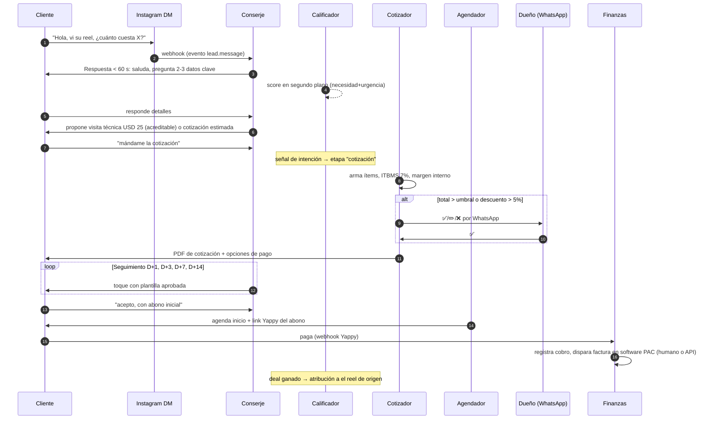

# 08 — Flujos de trabajo detallados

Cuatro flujos de punta a punta que muestran cómo los agentes cooperan, más el "día típico" del sistema.

---

## Flujo A — Lead de Instagram → venta cerrada

Puntos finos: la atribución nace en el link `wa.me/?text=Hola, vi su reel [REF-123]` o en el contexto del DM; el historial completo queda en `messages`; si el cliente se molesta o pide humano, el Conserje transfiere con resumen.

---

## Flujo B — Fotos de un trabajo → publicaciones en 6 redes

1. **Entrada (2 min humanos):** el dueño envía 15 fotos + 2 videos del trabajo terminado al WhatsApp interno del sistema, con una línea de contexto ("instalación en Costa del Este, cliente contento").
2. **Clasificación:** el Productor etiqueta (proyecto, etapa, calidad), detecta 3 fotos borrosas (descarta), detecta rostro de un tercero en una (la difumina), elige las 6 mejores tomas y el mejor clip.
3. **Mejora:** denoise + iluminación + enderezado en todas; variantes 1:1, 4:5, 9:16.
4. **Producción:** un reel 9:16 de 18 s (gancho: antes/después, subtítulos, música licenciada del catálogo de Meta/plantilla), un carrusel de 5 láminas (proceso), una historia con sticker de "escríbenos", miniatura para Short.
5. **Redacción:** títulos, copys por red (IG con hashtags locales, LinkedIn más técnico, GBP orientado a búsqueda local), CTAs a WhatsApp con referencia de campaña.
6. **Guardián:** verifica marca, ausencia de datos del cliente final (dirección exacta, placa, rostro), promesas prohibidas.
7. **Aprobación (60 primeros días):** el dueño recibe preview por WhatsApp → ✅.
8. **Publicación escalonada:** el Publicador agenda IG reel 12:00, FB 12:10, TikTok 18:00, Short 19:00, GBP y LinkedIn al día siguiente (el mismo material rinde 2 días de calendario).
9. **Medición:** a las 24/72 h el Analista captura métricas y leads atribuidos; el resultado alimenta el ranking de formatos.

Tiempo humano total: ~3 minutos. Tiempo del sistema: ~20 minutos.

---

## Flujo C — Día sin material nuevo → contenido de autoridad

1. 06:00 — Estratega revisa buffer: quedan 5 días < 7 → pide 3 piezas al Investigador.
2. Investigador consulta fuentes priorizadas (INEC, gremio del sector, Google Trends Panamá, normativa) → 3 fichas con cita+URL.
3. Redactor produce: 1 carrusel educativo ("5 cosas que exige la norma X — fuente citada"), 1 video de dato con plantilla animada, 1 encuesta de historia.
4. Guardián cruza cada cifra contra su ficha. Una afirmación sin fuente → rebotada y regenerada.
5. Cola de aprobación → publicación → medición. El pilar educativo mantiene viva la cuenta sin depender del dueño.

---

## Flujo D — Factura recibida → estado financiero actualizado

1. Proveedor envía factura PDF al correo compras@ (o el dueño fotografía el papel y lo manda por WhatsApp).
2. Capturador (OCR multimodal): RUC+DV válidos, fecha, ítems, ITBMS desglosado, total cuadra → `invoices_received`. No cuadra → cola de revisión con foto y motivo.
3. Clasificador: proveedor conocido → cuenta 5120 Materiales (regla); genera asiento doble partida.
4. Efectos inmediatos: flujo de caja proyectado resta el pago al vencimiento; ITBMS crédito fiscal suma al borrador del form. 430; margen del proyecto asociado se actualiza si la factura se etiquetó a un trabajo.
5. Si el gasto es atípico (> 2σ de su categoría) → Centinela avisa al dueño.

---

## El día típico del sistema (cron + eventos)

| Hora | Acción |
|------|--------|
| Continuo 24/7 | Conserje atiende WA/Messenger/IG/web < 60 s; Capturador procesa correos; webhooks de pagos concilian |
| 05:30 | Analista de métricas recolecta resultados de redes (día anterior) |
| 06:00 | Estratega revisa buffer editorial; dispara producción si falta |
| 06:30 | Finanzas: cierre del día anterior, ledger al día |
| 07:00 | **Director General envía el briefing diario al dueño** (WhatsApp): ventas de ayer, caja, citas de hoy, 3 cosas que requieren su decisión, 1 oportunidad detectada |
| 09:00–20:00 | Publicaciones según calendario (horas óptimas por red) |
| 13:00 | Seguimientos de cotizaciones (D+1/3/7/14) y recordatorios de cobro |
| 22:00 | Batch nocturno: clasificación contable, embeddings, experimentos A/B, backups |
| Lunes 07:00 | Briefing semanal del Director: embudo, P&L preliminar, recomendaciones priorizadas |
| Día 1 del mes | Reportes mensuales: comercial, marketing (ingreso por pilar), financieros; borrador ITBMS día 10 |

---

## El Director General en acción (ejemplos reales de interacción)

> **Dueño:** ¿Cuál fue el cliente más rentable este trimestre?
> **DG:** Constructora ABC: USD 9,400 facturados, margen 41% (USD 3,850), 3 proyectos, paga a 12 días promedio. Le sigue Hotel XYZ con margen 38% pero paga a 47 días — su rentabilidad real cae a ~34% si valoras el costo de caja. ¿Quieres que el Conserje le proponga a ABC el plan de mantenimiento anual? Tiene 78% de probabilidad de aceptar según su historial.

> **Dueño:** ¿Qué acciones debo tomar esta semana?
> **DG:** Tres, en orden de impacto: (1) Aprobar la cotización #0452 (USD 6,200, margen 44%) — el cliente preguntó dos veces, se enfría. (2) Cobrar a Cliente M: USD 1,850 vencidos hace 18 días; ya envié 2 recordatorios, toca llamada tuya. (3) El pilar "antes/después" generó 71% de los leads del mes con 40% del esfuerzo — autoricé al Estratega a subirlo al 50% del calendario, confírmalo o lo revierto.

El DG responde **solo con datos de la BD** (consultas SQL vía herramientas, nunca cifras inventadas) y cada recomendación enlaza la evidencia.
