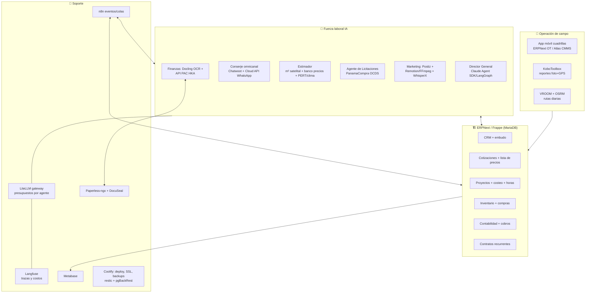

# 12 — Arquitectura evolucionada (v2, v3, ideal) y efecto 10X

Rediseño del sistema usando los hallazgos del [doc 11](11-investigacion-open-source.md). La diferencia estructural contra el v1: **ya no construimos un ERP a medida con agentes alrededor — adoptamos un ERP open source maduro (ERPNext) como esqueleto transaccional y los agentes IA se convierten en la fuerza laboral que lo opera.** El v1 subestimaba la capa operativa (cuadrillas, órdenes de trabajo, costeo de obra); el v2 la pone en el centro, porque ahí vive la rentabilidad de este negocio.

---

## 1. Arquitectura v2 — "Esqueleto comprado, músculos de IA" (construible hoy, nivel económico/profesional)

**Asignación exacta de software por componente (v2):**

| Componente | Software | Licencia | Sustituye del v1 |
|---|---|---|---|
| ERP/CRM/cotización/inventario/proyectos/contabilidad | ERPNext 15+ (Frappe) | GPLv3 | ~70% del esquema Postgres a medida y sus pantallas |
| Órdenes de trabajo móviles | Módulos ERPNext → Atlas CMMS si el piloto lo exige | GPLv3 / AGPLv3 | (hueco del v1) |
| Reportes fotográficos georreferenciados | KoboToolbox self-hosted | AGPL | (hueco del v1) |
| Rutas de cuadrillas | VROOM + OSRM (mapas OSM Panamá) | BSD/BSD | (hueco del v1) |
| Medición de terrenos | Leaflet + Turf.js embebido en el portal de cotización | BSD/MIT | (hueco del v1) |
| Omnicanal (WA/FB/IG) | Chatwoot + WhatsApp Cloud API oficial | MIT / API Meta | igual que v1, confirmado |
| Bots de flujo estructurado | Typebot (agendar visita, encuesta post-trabajo) | AGPL/fair-code parcial — verificar | a medida |
| Publicación social 6 redes | Postiz self-hosted | AGPL-3.0 | Metricool (~USD 660/año) |
| Render de reels/shorts | Remotion (gratis ≤3 empleados; revisar al crecer) o Revideo + FFmpeg + WhisperX subtítulos | Remotion lic. propia / MIT | Creatomate (~USD 600–2,400/año) |
| Mejora de imagen | sharp + Real-ESRGAN + rembg | Apache/BSD/MIT | Cloudinary AI |
| TTS español | Piper/Kokoro (self-hosted); ElevenLabs solo piezas premium | MIT/Apache | 80% del gasto ElevenLabs |
| Agentes con estado + compuertas humanas | Claude Agent SDK o LangGraph | MIT | workers a medida |
| Gateway LLM | LiteLLM | MIT | control de costos a medida |
| Observabilidad LLM | Langfuse self-hosted | MIT (núcleo) | audit_log a medida (parcial) |
| OCR facturas/pliegos | Docling + PaddleOCR | MIT/Apache | prompts multimodales sueltos |
| Facturación electrónica | API PAC The Factory HKA desde ERPNext | comercial (PAC) | limitación abierta del v1 |
| Documental + firma | Paperless-ngx + DocuSeal + Gotenberg | GPL/AGPL/MIT | (hueco del v1) |
| BI | Metabase OSS sobre réplica analítica | AGPL | igual v1 |
| Automatización/eventos | n8n (Sustainable Use — válido para uso interno) | fair-code ⚠️ | igual v1 |
| Deploy/operación | Coolify o Dokploy + Uptime Kuma + Netdata + restic/pgBackRest | Apache/MIT | scripts manuales |
| Scraping banco de precios | Crawlee o Scrapy + Playwright, programado en n8n | Apache/BSD | (hueco del v1) |

**Costo de software del v2: ~USD 0 en licencias.** Gastos reales: infra (2 VPS, ~USD 80–150/mes), tokens LLM, conversaciones WhatsApp, PAC (folios), y el SaaS que decida conservarse por conveniencia. Comparado con el v1 profesional (~USD 1,200/mes), el v2 baja la operación a **~USD 500–800/mes** y elimina 12–18 meses-dev de construcción.

---

## 2. Arquitectura v3 — "Empresa de datos" (12–24 meses, cuando el v2 esté rodando)

Todo lo del v2, más:

| Capa | Software | Para qué |
|---|---|---|
| Warehouse analítico | ClickHouse o DuckDB + dbt-core | Histórico de métricas sociales, precios de materiales, productividad por cuadrilla — análisis que MariaDB no debe cargar |
| Pronóstico | statsforecast (Nixtla) / Prophet | Demanda por servicio y estación, proyección de caja a 13 semanas con intervalos |
| Scoring ML propio | scikit-learn sobre el histórico del CRM | Probabilidad de cierre por lead, probabilidad de pago a tiempo por cliente |
| Motor de decisión | Reglas (ej. GoRules/zen-engine) + Director | Descuentos, priorización de licitaciones, asignación de cuadrillas — decisiones auditables, no "vibes" del LLM |
| Workflows durables | Temporal (si el volumen lo justifica) | Procesos de semanas (licitación → adjudicación → ejecución → cobro) con garantías |
| Identidad | Authentik | SSO cuando haya >5 usuarios humanos |
| APM completo | SigNoz | Trazas de todo el stack, no solo LLM |
| Voz | Pipecat/LiveKit Agents + STT/TTS | Llamadas entrantes atendidas por agente (la llamada sigue siendo el canal #1 de clientes mayores en Panamá) |

## 3. Arquitectura ideal (norte)

La versión donde el sistema opera la empresa y los humanos hacen relaciones y criterio: agentes con autoridad delegada por bandas (precios estacionales, pauta publicitaria, compras de stock ≤ USD X) gobernados por el motor de decisión y auditados por Langfuse; gemelo financiero de la empresa (simulación: "¿qué pasa si subo 8% jardinería?"); licitaciones de punta a punta con expediente armado y solo la firma humana; cuadrillas guiadas por ruta+checklist+fotos con cierre de calidad automático por visión. Ninguna pieza requiere ciencia ficción — solo las compuertas abriéndose con evidencia.

---

## 4. Efecto 10X — capacidades que multiplican el negocio (priorizadas por ROI)

1. **Agente de Licitaciones PanamaCompra** ⭐ el mayor 10X disponible. Los datos OCDS se publican semanalmente con API; el portal publica los actos en curso a diario. El agente: (a) vigila categorías de jardinería/mantenimiento/limpieza/pintura, (b) puntúa fit (monto, ubicación, requisitos, competencia histórica de esa entidad — los datos históricos de adjudicación son públicos: se sabe a qué precio gana quién), (c) arma el borrador del expediente (carta, desglose de precios con el motor de estimación, vigencias de paz y salvo DGI/CSS desde Paperless-ngx), (d) alerta fechas de visita previa y cierre. Requisito humano: registro de proponente, fianzas y firma. **Impacto: acceso sistemático al cliente más grande del país con costo marginal de propuesta cercano a cero.**
2. **Cotización por m² sin visita** — Leaflet+Turf: el cliente comparte ubicación → se dibuja el polígono → m² × tarifa de mantenimiento por área (con factores de pendiente/acceso) → cotización preliminar en la misma conversación de WhatsApp, en minutos. La visita técnica (USD 25) queda para casos complejos o cierre.
3. **Estimador no-optimista** — three-point/PERT por tarea (optimista/probable/pesimista) con factores multiplicadores configurados: clima (Open-Meteo: temporada lluviosa mayo–nov agrega 15–30% a trabajos exteriores), retraso de materiales (lead time real por proveedor del banco de precios), cambios de alcance (histórico propio), productividad real por cuadrilla (de las horas registradas en las órdenes de trabajo). **El sistema aprende: cada trabajo cerrado compara estimado vs. real y corrige los factores — la cotización del mes 12 es mejor que la del mes 1.**
4. **Banco de precios de materiales** — scraping programado de Cochez, Novey y Punto Cochez (catálogos públicos online): histórico de precios por SKU, comparador de proveedores, alerta de subidas que invaliden cotizaciones vigentes, y actualización automática de los costos del estimador. Cada cotización usa precio de mercado de esta semana, no de memoria.
5. **Costo real del día-hombre** — el motor cotiza con costo cargado, no con salario: USD 35/día base + CSS patronal 12.25% + riesgo profesional + décimo (8.33%) + vacaciones (8.33%) + prima de antigüedad ≈ **factor 1.35–1.45 → USD 47–51/día-hombre real**. Las tarifas se validan contra el decreto de salario mínimo vigente (D.E. 13/2025: construcción $3.51/h R1 → USD 35/8h = $4.38/h cumple; se re-verifica con cada decreto bianual). Cotizar con costo desnudo era la fuga de margen silenciosa.
6. **Rutas de cuadrillas (VROOM)** — secuencia óptima de visitas diarias por cuadrilla con ventanas horarias → 1 trabajo más por cuadrilla/día en mantenimientos = ~15–25% más capacidad con la misma planilla.
7. **Evidencia que cobra** — KoboToolbox: reporte fotográfico georreferenciado y fechado de cada avance, compilado automáticamente en informe PDF con membrete → adjunta a la cuenta presentada al cliente gubernamental → menos disputas, cobro más rápido (ataca el DSO directamente). **Y las mismas fotos alimentan el pipeline de marketing: la evidencia operativa es el contenido.** Un solo flujo, dos retornos.
8. **Contratos recurrentes (MRR)** — ERPNext Subscriptions: convertir trabajos puntuales en planes de mantenimiento mensual (jardinería, limpieza) con generación automática de órdenes de trabajo, facturación y cobro. El 10X de valuación de la empresa está aquí: ingresos predecibles.
9. **Post-venta automática** — al cerrar la orden de trabajo: solicitud de reseña Google (GBP API), foto antes/después al cliente, oferta del plan recurrente, y código de referido. Cuatro mensajes que hoy no se envían.
10. **Predicción y alerta comercial** — statsforecast sobre el histórico: "agosto será 30% más bajo en pintura exterior (lluvia); empuja contratos internos de limpieza desde julio" — el Director lo convierte en campañas y metas concretas.

---

## 5. Stacks completos (Fase 7)

| | Económico (~150–400/mes) | Profesional (~500–900/mes) | Empresarial (~1,500–3,000/mes) | Extremo |
|---|---|---|---|---|
| ERP | ERPNext en 1 VPS | ERPNext + réplica analítica | ERPNext HA / Frappe Cloud | + multi-entidad |
| Campo | OT de ERPNext móvil | + KoboToolbox + VROOM | + Atlas CMMS dedicado | + visión QA de fotos |
| IA | Claude API directo + n8n | + LiteLLM + Langfuse + Agent SDK | + LangGraph flujos críticos + evaluaciones | + voz (Pipecat) + motor de decisión + Temporal |
| Marketing | Postiz + FFmpeg/WhisperX | + Remotion/Revideo + Real-ESRGAN | + ComfyUI con GPU alquilada | + generación masiva multivariante |
| Datos | MariaDB + Metabase | + Postgres réplica + pgBackRest | + ClickHouse + dbt + statsforecast | + warehouse completo + ML propio |
| Soporte | Coolify, Uptime Kuma, restic | + Paperless-ngx, DocuSeal, Infisical | + Authentik, SigNoz | + DR multi-región |
| Licitaciones | alertas OCDS semanales | + scoring y calendario | + expediente asistido completo | + inteligencia competitiva de adjudicaciones |

**Impacto sobre el cronograma del v1 ([doc 09](09-cronograma.md)):** las fases no cambian de orden, pero la Fase 1–3 deja de construir esquema/cotizador/contabilidad a medida y pasa a **configurar ERPNext + integrar** (HKA, Chatwoot, agentes). Estimación revisada: **sistema profesional v2 en 10–12 semanas en lugar de 16**, con más capacidades (campo, licitaciones, documental) que el v1 no tenía.

**Respuesta a la pregunta rectora:** la combinación que permite facturar 10× sin multiplicar administración es: *ERPNext como esqueleto transaccional gratuito + agentes IA como personal administrativo digital (ventas, cotización, cobranza, marketing, licitaciones) + instrumentación de campo barata (móvil, fotos GPS, rutas) que convierte cada trabajo en datos que mejoran la siguiente cotización.* El personal humano crece con las cuadrillas (que sí facturan), no con la oficina.
