# 13 — Auditoría integral, sistema de inteligencia de costos y arquitectura optimizada

---

## PARTE A — AUDITORÍA BRUTAL DE LA ARQUITECTURA

Actúo como CTO, auditor financiero, consultor de operaciones y especialista en ERP tratando de romper mis propias decisiones.

### 1. Supuestos incorrectos encontrados

| # | Supuesto del v1/v2 | Realidad | Impacto | Corrección |
|---|---|---|---|---|
| S1 | "Trabajador general: USD 35/día" como costo | USD 35 es el **salario bruto**. El costo real para la empresa incluye CSS patronal (13.25% en 2026, subiendo a 14.25% en 2027 y 15.25% en 2029 — [Ley 462/2025](https://www.prensa.com/politica/css-aumento-del-1-en-aportes-patronales-a-la-css-entrara-en-vigor-en-abril-proximo/)), riesgo profesional (hasta 5.67% para jardinería/construcción), seguro educativo patronal (1.50%), décimo tercer mes (8.33%), vacaciones (1/11 ≈ 9.09%), prima de antigüedad (1.92% anualizado). **Factor de carga real: 1.42–1.52** | Cotizar con USD 35 en lugar de USD 50–53 destruye el margen silenciosamente | **Corrección ejecutada abajo en el Motor de Costos** |
| S2 | "El scraping de precios de ferreterías es viable" | Cochez, Novey, Do It Center y Punto Cochez tienen tiendas online **con precios públicos** (verificado: Cochez muestra precios como $18.97/galón de pintura Pro Latex), pero los servidores usan protección anti-bot agresiva (CloudFlare/WAF → HTTP 403 a fetch directo) | No se puede hacer scraping trivial con requests; se requiere Playwright/headless browser con rotación | Diseño con **Playwright headless + caché local + ética (frecuencia baja, user-agent honesto)** |
| S3 | "ERPNext reemplaza 70% del desarrollo a medida" | ERPNext corre sobre **MariaDB, no Postgres**, y su módulo field service nativo tiene capacidades básicas. Las búsquedas de 2026 confirman que el field service "es suficiente para necesidades básicas" con fotos y firma móvil, pero funcionalidades avanzadas pueden requerir complementos | La elección de MariaDB obliga a réplica para analítica, y el field service puede necesitar Atlas CMMS después de todo | Aceptar MariaDB como costo de adopción; plan B Atlas CMMS si el piloto falla |
| S4 | "n8n es open source" | No lo es. La Sustainable Use License de n8n permite uso **solo para propósitos internos de negocio** ([docs n8n](https://docs.n8n.io/sustainable-use-license/)). Para esta empresa (uso interno) es legal. Pero NO es OSI-approved ni la licencia permite redistribución | Para uso interno: **cero problema legal**. Pero si la empresa crece y ofrece servicios de automatización a clientes: problema. Alternativa MIT: Activepieces | Mantener n8n con nota de licencia; tener Activepieces identificada como plan B |
| S5 | "El ITBMS es siempre 7%" | Correcto para servicios en general, pero hay **exenciones y tasas especiales**. Servicios de jardinería y limpieza para instituciones del Estado pueden tener tratamiento especial bajo contratos gubernamentales. Además, contribuyentes con ingresos brutos < USD 36,000/año están exentos de ITBMS | El motor de cotización necesita manejar ITBMS condicional, no hardcoded al 7% | Configurable por tipo de cliente/servicio |

### 2. Dependencias innecesarias eliminadas

| Componente | Por qué estaba | Por qué se elimina |
|---|---|---|
| **pgvector como almacén RAG separado** | "Base de conocimiento semántica" | La base de conocimiento de esta empresa tiene ~200 FAQs, ~50 fichas de servicios, ~20 normativas. Caben en un JSON/tabla Postgres simple con búsqueda full-text. pgvector es un cañón para una mosca. Se incorpora solo si se crece a miles de documentos |
| **Investigador de fuentes para contenido educativo** (agente separado) | "Contenido con fuentes citadas" | Una PyME de jardinería no necesita un agente investigador independiente. Un prompt bien diseñado en el agente de contenido busca directamente y cita. Un agente menos = un proceso menos que mantener |
| **ComfyUI / GPU** (nivel pro) | "Generación de variantes de imagen" | Para fotos de trabajos reales, sharp + Real-ESRGAN + rembg hace todo lo necesario. ComfyUI añade complejidad operativa sin retorno de negocio medible. Se descarta |
| **Typebot** (builder de flujos de bot) | "Flujos estructurados de agendamiento" | El conserje IA con Agent SDK ya maneja flujos conversacionales. Typebot duplica capacidad y añade otro sistema a mantener |
| **Remotion** (render de video) | "Reels con plantilla de marca" | La licencia de Remotion es gratuita solo para ≤3 empleados (las condiciones exactas cambian). Para esta empresa, **FFmpeg + MoviePy + WhisperX** produce reels con subtítulos y música de forma más simple y sin riesgo de licencia |
| **Agente Director General** (como agente 24/7 separado) | "Supervisa todo" | Redefinir: no es un agente corriendo siempre, es un **reporte programado** (diario, semanal) + un **chatbot bajo demanda** que consulta SQL. Mismo resultado, fracción del costo de tokens |
| **Motor de decisión separado** (GoRules/zen-engine) | "Decisiones auditables" | Las reglas de negocio (descuentos, aprobaciones, scoring) caben en la configuración del ERP + lógica en n8n. Un motor de reglas separado es sobre-ingeniería a esta escala |

### 3. Componentes redundantes

| Redundancia | Resolución |
|---|---|
| ERPNext CRM + Chatwoot como CRM | ERPNext maneja el embudo (Lead→Opportunity→Quotation→Sales Order). Chatwoot maneja la **conversación en tiempo real** (bandeja de mensajes). No son redundantes: son complementarios. Pero la data vive en ERPNext; Chatwoot es el "teléfono", no la "libreta" |
| ERPNext Quotation + "Cotizador a medida" | Se elimina el cotizador a medida. ERPNext Quotation con lista de precios, reglas de descuento y plantilla PDF es suficiente. Los agentes IA llaman a la API de ERPNext para crear cotizaciones, no a un motor propio |
| ERPNext Accounting + "Clasificador contable IA" | ERPNext ya tiene plan de cuentas, reglas de compra, y contabilidad de doble partida automática al registrar facturas. El "clasificador IA" solo se necesita para **facturas recibidas por foto/email que entran por OCR** — un caso específico, no un sistema general |
| Metabase + "Dashboards del Director" | Se unifican: los dashboards ejecutivos son preguntas guardadas en Metabase sobre la BD de ERPNext. El Director IA responde vía SQL a ERPNext, no construye dashboards propios |

### 4. Puntos únicos de fallo

| SPOF | Mitigación real |
|---|---|
| **El VPS** (todo en uno) | Backups diarios con pgBackRest/restic + snapshot del VPS. RTO real: 2–4 horas. Para nivel pro: segundo VPS con réplica de MariaDB en standby |
| **El número de WhatsApp** | Segundo número verificado en standby (pero inactivo para no pagar). Todos los contactos viven en ERPNext, no en WhatsApp |
| **La cuenta de Meta Business** (FB/IG/Messenger) | Esto no tiene mitigación técnica: si Meta te baja la cuenta, perdiste esos canales. Mitigación real: cumplir políticas, no depender al 100% de un canal, construir base de contactos propia (ERPNext + WhatsApp opt-in) |
| **Claude API** | LiteLLM con fallback a modelo alternativo (Sonnet → otro proveedor). Los prompts son portables |
| **El operador humano** (dueño) | Si el dueño no puede aprobar en 12h, el sistema tiene reglas de timeout: contenido de bajo riesgo se publica, cotizaciones esperan, las alertas financieras se acumulan. El sistema no se paraliza |

### 5. Costos ocultos identificados

| Costo oculto | Estimación mensual | Mitigación |
|---|---|---|
| Conversaciones WhatsApp fuera de ventana 24h (plantillas utility/marketing) | USD 30–100 (a 500+ leads/mes) | Responder rápido para mantener ventana abierta; usar utility (más barata) sobre marketing |
| Tokens LLM del conserje en conversaciones largas o circulares | USD 50–200 si no se controla | Límite de 15 turnos por conversación antes de escalar a humano; caching de prompts |
| Mantenimiento del scraper de precios (cambios de sitio web) | 2–4 horas humanas/mes | Alertas de fallo + diseño resiliente (ver sistema de inteligencia de costos) |
| Actualizaciones de ERPNext (releases mayores anuales) | 8–16 horas/año + riesgo de rotura de customizaciones | Limitar customizaciones a campos/doctypes Frappe; evitar modificar core |
| Folios del PAC (The Factory HKA) para facturación electrónica | USD 15–50/mes según volumen | Costo fijo del negocio, no del sistema |
| Almacenamiento de fotos de campo que crece sin límite | ~2 GB/mes a 20 trabajos/mes × 20 fotos/trabajo × 3MB | Compresión automática + política de retención (full-res 12 meses, thumbnail después); R2 sin costo de egreso |

### 6. Integraciones frágiles

| Integración | Fragilidad | Plan de contingencia |
|---|---|---|
| Postiz → APIs de Meta/TikTok/LinkedIn | Las APIs de redes sociales cambian 1–2×/año; Postiz como intermediario puede retrasarse en adaptarse | Monitorear releases de Postiz; tener cuenta de Metricool (USD 55/mes) como backup instantáneo |
| Scraper → sitios de ferreterías | Cambio de estructura HTML rompe el scraper | Alertas de fallo + diseño por selectores CSS resilientes + fallback manual (un precio de referencia vencido sigue siendo útil 30 días) |
| ERPNext → API PAC HKA | Integración custom sobre API del proveedor | Documentar y versionar; el PAC tiene incentivo de estabilidad (cobra por uso) |

---

## PARTE B — SISTEMA DE INTELIGENCIA DE COSTOS AUTÓNOMO

### Arquitectura del banco de precios

```mermaid
flowchart LR
    subgraph FUENTES["Fuentes"]
        C1[cochezycia.com<br/>Magento-like, 2,795+ productos]
        C2[puntocochez.com<br/>Magento2, precios públicos]
        C3[novey.com.pa<br/>Ecommerce, precios públicos]
        C4[doitcenter.com.pa<br/>30,000+ productos]
        C5[sherwinca.com<br/>Catálogo Sherwin Williams CA]
        C6[pintuco.com.pa<br/>Catálogo Pintuco Panamá]
        I1[INEC Panamá<br/>Índice precios construcción]
        I2[Datos abiertos Panamá<br/>Estadísticas]
    end
    subgraph MOTOR["Motor de captura"]
        SC[Scrapers con Playwright<br/>headless + proxies]
        NORM[Normalizador<br/>unidad, marca, categoría]
        CACHE[Caché local 30 días<br/>precio válido si falla fuente]
    end
    subgraph BANCO["Banco de precios (ERPNext)"]
        DB2[(Item Price / Price List<br/>ERPNext)]
        HIST[(Histórico de precios<br/>tabla custom)]
        ALERT2[Alertas: cambio >10%<br/>descontinuado, nueva alternativa]
    end
    subgraph USO["Uso"]
        COT3[Motor de cotización]
        COMP[Comparador de proveedores]
        MARG[Cálculo de margen]
    end
    FUENTES --> MOTOR --> BANCO --> USO
```



### Diseño técnico del scraper

**Principios:**
1. **Legalidad:** solo datos públicos de precios publicados en tiendas online accesibles sin login. Sin violar robots.txt. Sin sobrecargar servidores (1 request/5 segundos mínimo, horario nocturno).
2. **Resiliencia:** cada fuente puede fallar sin matar el sistema. Un precio de hace 30 días es mejor que ninguno. Alertas cuando un scraper falla 3 veces consecutivas.
3. **Normalización:** el mismo producto (galón de pintura acrílica blanca mate) tiene nombres distintos en cada tienda → normalización por categoría + unidad + tipo, no por nombre exacto.

**Implementación (n8n + Playwright):**

```
Flujo semanal por proveedor (domingo 2:00 AM):
1. n8n dispara workflow "Actualizar precios [Cochez]"
2. Worker con Playwright headless navega categorías configuradas:
   - Pinturas → /productos-pintura (estructura: cochezycia.com/[categoria])
   - Herramientas → /productos-ferreteria
   - Jardinería → si existe
3. Por cada producto: extrae nombre, precio regular, precio oferta, SKU, URL, imagen
4. Normaliza: categoría estándar, unidad (galón/5gal/unidad/m²), marca
5. Compara contra último precio registrado:
   - Sin cambio → actualiza fecha de verificación
   - Cambio > 0% → registra nuevo precio, mantiene histórico
   - Cambio > 10% → alerta
   - Producto no encontrado 3 semanas seguidas → marca como posiblemente descontinuado
6. Resultado → tabla ERPNext Item Price actualizada vía API

Manejo de fallos:
- 403/WAF block → retry con user-agent rotado, máximo 3 intentos
- Estructura HTML cambió → scraper falla → alerta al administrador → precio anterior sigue válido 30 días
- Fuente caída → skip, siguiente proveedor, alerta
```

**Fuentes iniciales priorizadas:**

| Fuente | Productos relevantes | Método | Frecuencia |
|---|---|---|---|
| **cochezycia.com** | Pintura, selladores, herramientas, ferretería general | Playwright (WAF activo) | Semanal |
| **puntocochez.com** | Mismo grupo, precios pueden diferir; Magento2 (detectado en URLs) | Playwright | Semanal |
| **novey.com.pa** | Herramientas, eléctricos, ferretería, decoración | Playwright | Semanal |
| **doitcenter.com.pa** | 30,000+ productos: pintura Sherwin Williams, herramientas, jardín | Playwright | Semanal |
| **sherwinca.com** | Catálogo de pinturas Sherwin Williams Centroamérica (referencia, puede no tener precio) | Fetch simple si no tiene WAF | Mensual |
| **pintuco.com.pa** | Pinturas Pintuco Panamá | Fetch/Playwright | Mensual |
| **INEC Panamá** (inec.gob.pa) | Índice de precios de materiales de construcción (PDF mensual, deflactores) | Descarga PDF + OCR/extracción | Mensual |
| **Salario mínimo (MITRADEL)** | Decreto vigente de salarios | Manual o scrape de gaceta | Al publicarse (cada 2 años) |

**Productos a rastrear inicialmente (categorías del negocio):**

| Categoría | Productos clave | Para cotizar |
|---|---|---|
| Pintura | Látex acrílica 1gal y 5gal (mate, semi-brillo), sellador, impermeabilizante, esmalte | Pintura residencial/comercial |
| Herramientas de jardinería | Podadora, guadaña, machete, rastrillo, manguera, aspersores | Jardinería y poda |
| Limpieza | Químicos industriales, desengrasante, cloro, herramientas de limpieza | Limpieza profunda |
| Construcción menor | Cemento, bloques, mortero, cerámica, pegamento, tornillería | Remodelaciones |
| Protección/seguridad | Guantes, lentes, casco, arnés | Costo indirecto por proyecto |

### Detección automática de cambios y alternativas

1. **Cambio de precio >10%**: notificación inmediata al dueño vía WhatsApp. Si hay cotizaciones vigentes que usan ese material, alerta de riesgo de margen con lista de cotizaciones afectadas.
2. **Producto descontinuado** (no encontrado 3 semanas seguidas): buscar automáticamente productos similares en la misma categoría/tamaño en los otros proveedores. Sugerir alternativa con delta de precio.
3. **Nueva alternativa más barata**: cuando un producto nuevo aparece en la categoría con precio ≥20% menor que el producto actual de referencia, notificar como oportunidad.
4. **Histórico de precios**: gráfico de tendencia por producto, visible en Metabase. El Director mensual reporta: "el precio promedio de pintura subió 5% este trimestre; ajustar tarifa de pintura residencial".

---

## PARTE C — MOTOR DE COSTOS LABORALES REAL (PANAMÁ 2026)

### Cálculo verificado del costo real del día-hombre

Base: trabajador a USD 35/día (USD 4.375/h, jornada de 8h).
Salario mensual estimado: USD 35 × 26 días laborables = **USD 910/mes**.

| Concepto | Base legal / fuente | % sobre salario | USD/mes | USD/día |
|---|---|---|---|---|
| Salario bruto | Contrato | 100% | 910.00 | 35.00 |
| CSS patronal (SEM + IVM) | Ley 462/2025, vigente abr-2025. 13.25% hasta feb-2027 | 13.25% | 120.58 | 4.64 |
| Riesgo profesional | CSS, varía por actividad. Jardinería/construcción: ~5.67% (tasa para actividades de mayor riesgo) | 5.67% | 51.60 | 1.98 |
| Seguro educativo patronal | Ley | 1.50% | 13.65 | 0.53 |
| Décimo tercer mes | 1/12 del salario anual, pagado en 3 partidas (15-abr, 15-ago, 15-dic) | 8.33% | 75.82 | 2.92 |
| Vacaciones | 1 día por cada 11 trabajados = 1/11 | 9.09% | 82.73 | 3.18 |
| Prima de antigüedad | 1 semana/año = 1/52 (provisionada mensualmente) | 1.92% | 17.47 | 0.67 |
| **Total cargas sobre salario** | | **39.76%** | **361.85** | **13.92** |
| **Costo laboral total** | | **139.76%** | **1,271.85** | **48.92** |

**Factor de carga real verificado: 1.40** (redondeando, sin incluir costos indirectos).

Pero eso no es todo. Los **costos indirectos por día-hombre** que destruyen márgenes si no se cotizan:

| Costo indirecto | Estimación/día por trabajador | Fuente |
|---|---|---|
| Transporte/combustible (llevar cuadrilla al sitio) | USD 3–8 | Depende de distancia; promedio Ciudad de Panamá |
| Desgaste de herramientas y equipos | USD 1–3 | Amortización mensual de inventario |
| EPP (equipo de protección personal) | USD 0.50–1 | Amortización |
| Materiales de consumo (gasolina guadaña, bolsas, etc.) | USD 2–5 | Variable por servicio |
| Supervisión/administración (el dueño o capataz) | USD 3–5 prorrateado | Si 1 supervisor maneja 3 cuadrillas |
| Seguro de responsabilidad civil (si aplica) | USD 0.50–2 | Póliza anual prorrateada |
| **Total indirecto estimado** | **USD 10–24/día/trabajador** | |

**Costo total real del día-hombre: USD 49–73** (vs. los USD 35 nominales).

Para cotización: usar **USD 55–60/día como costo base** (conservador, incluye cargas + indirectos medios), y vender a **USD 85–120/día** (margen 40–50% sobre costo).

### Implementación en ERPNext

```
DocType: Employee Cost Rate (custom)
├── employee_type: [General, Capataz, Especialista]
├── daily_wage: 35.00
├── css_patronal_pct: 13.25  ← se actualiza cuando sube (2027: 14.25)
├── riesgo_profesional_pct: 5.67
├── seguro_educativo_pct: 1.50
├── decimo_pct: 8.33
├── vacaciones_pct: 9.09
├── prima_antiguedad_pct: 1.92
├── factor_carga: 1.3976  ← calculado
├── daily_cost_labor: 48.92  ← calculado
├── daily_overhead: 12.00  ← configurable
├── daily_cost_total: 60.92  ← calculado
├── daily_sell_rate: 100.00  ← configurable
├── effective_date: 2026-01-16
```

El motor de cotización en ERPNext (BOM/Quotation) usa `daily_cost_total` para estimar, y `daily_sell_rate` para cotizar. El margen se calcula automáticamente.

---

## PARTE D — AUDITORÍA DE RENTABILIDAD POR MÓDULO

### Clasificación por ROI

| # | Módulo | Ingresos que genera o protege | Costo que ahorra | Horas admin/semana eliminadas | ROI estimado | Dificultad | **Fase** |
|---|---|---|---|---|---|---|---|
| 1 | **Conserje WhatsApp 24/7** | USD 2,000–10,000/mes (leads que hoy se pierden por respuesta lenta) | 15–20 h/semana de responder mensajes | 15–20 | **10x+** en 3 meses | Media | **AHORA** |
| 2 | **Motor de cotización con costos reales** | Protege 8–15% del margen que hoy se pierde por cotizar con costo desnudo | 5–8 h/semana de hacer cotizaciones a mano | 5–8 | **5x** en 2 meses | Baja (ERPNext trae Quotation) | **AHORA** |
| 3 | **Seguimiento post-cotización automatizado** | 20–40% más cierres (los que hoy se pierden por no dar seguimiento) | 3–5 h/semana | 3–5 | **8x** | Baja | **AHORA** |
| 4 | **ERPNext como ERP central** | Base para todo lo demás; elimina Excel/papel | 8–12 h/semana de administración manual | 8–12 | **3x** (enabler) | Media-alta (setup 3–4 semanas) | **AHORA** |
| 5 | **Agente de licitaciones PanamaCompra** | USD 5,000–50,000+/año en contratos gubernamentales nuevos | 4–8 h/semana de buscar y armar expedientes | 4–8 | **20x** si gana 1 contrato | Media | **Fase 2** |
| 6 | **Publicación diaria multicanal** | USD 500–3,000/mes en leads orgánicos (acumulativo a 6+ meses) | 5–10 h/semana de crear y publicar contenido | 5–10 | **3x** a 6 meses | Media | **Fase 2** |
| 7 | **Pipeline multimedia (fotos→reels)** | Aumenta calidad y volumen del contenido → más leads | 3–5 h/semana | 3–5 | **2x** | Media | **Fase 2** |
| 8 | **Banco de precios automatizado** | Protege margen + acelera cotización + detecta oportunidades | 2–4 h/semana de consultar precios manualmente | 2–4 | **3x** | Media | **Fase 2** |
| 9 | **Contratos recurrentes (MRR)** | USD 2,000–20,000/mes en ingresos predecibles | 3–5 h/semana de facturación manual recurrente | 3–5 | **5x** | Baja (ERPNext Subscriptions) | **Fase 2** |
| 10 | **Órdenes de trabajo móviles + fotos GPS** | Reduce disputas de cobro (especialmente con gobierno) | 2–3 h/día de supervisión presencial | 10+ | **4x** | Media | **Fase 2** |
| 11 | **Cotización por m² satelital** | Elimina visitas técnicas innecesarias → más cotizaciones/día | 2–4 h/semana en visitas que no cierran | 2–4 | **3x** | Media | **Fase 3** |
| 12 | **Rutas optimizadas (VROOM)** | 1 trabajo más/cuadrilla/día = 15–25% más capacidad | Combustible y tiempo | 0 (ahorro operativo) | **2x** | Baja-media | **Fase 3** |
| 13 | **Finanzas automatizadas + alertas** | Reduce DSO 5–15 días (cobro más rápido); detecta fugas | 4–8 h/semana de contabilidad manual | 4–8 | **2x** | Media | **Fase 3** |
| 14 | **Dashboards Metabase** | Mejores decisiones (no medible directamente) | 2–3 h/semana de hacer reportes | 2–3 | **1.5x** | Baja | **Fase 3** |
| 15 | ~~Agente Director General 24/7~~ | Reemplazado por reporte programado + chatbot bajo demanda | — | — | — | — | Simplificado |
| 16 | ~~ComfyUI / GPU para imágenes~~ | Cero impacto medible vs. sharp+ESRGAN | — | — | — | — | **Eliminado** |
| 17 | ~~pgvector / RAG complejo~~ | Full-text search en ~200 FAQs es suficiente | — | — | — | — | **Eliminado** |
| 18 | ~~Motor de decisión separado~~ | Reglas en ERPNext + n8n cubren todo | — | — | — | — | **Eliminado** |
| 19 | ~~Typebot~~ | Duplica al conserje IA | — | — | — | — | **Eliminado** |

**Resultado: el sistema v1 tenía ~15 agentes y ~25 componentes. El sistema optimizado tiene 8 capacidades de alto ROI en fases 1–2, 6 de medio ROI en fase 3, y 5 eliminados.** Total de componentes operativos: ~14 (vs. ~25). Lo que se elimina no genera dinero; lo que queda sí.

---

## PARTE E — ARQUITECTURA FINAL OPTIMIZADA

Cada componente que sobrevivió tiene que justificar su existencia con un número.

### Principio rector

> "El sistema más rentable es el que tiene el menor número de piezas que generan el mayor impacto en cotización, cierre, cobro y repetición."

### Stack final

```
┌─────────────────────────────────────────────────────────────────┐
│                    ARQUITECTURA OPTIMIZADA                       │
├─────────────────────────────────────────────────────────────────┤
│                                                                  │
│  CAPA 1 — VENDER (ROI inmediato, AHORA)                        │
│  ┌──────────────┐  ┌──────────────┐  ┌──────────────────────┐  │
│  │ Chatwoot      │  │ Conserje IA  │  │ ERPNext              │  │
│  │ WA Cloud API  │→ │ Claude Sonnet│→ │ Lead→Quotation→      │  │
│  │ Messenger     │  │ via LiteLLM  │  │ Sales Order→Invoice  │  │
│  │ IG DM         │  │              │  │ + costos cargados    │  │
│  │ Web forms     │  │ + seguimiento│  │ + descuentos/aprob.  │  │
│  └──────────────┘  └──────────────┘  └──────────────────────┘  │
│                                                                  │
│  CAPA 2 — OPERAR (ROI a 3 meses, Fase 2)                       │
│  ┌──────────────┐  ┌──────────────┐  ┌──────────────────────┐  │
│  │ Licitaciones  │  │ OT móviles   │  │ Marketing            │  │
│  │ PanamaCompra  │  │ ERPNext app  │  │ Postiz + FFmpeg +    │  │
│  │ OCDS API      │  │ + KoboTools  │  │ WhisperX + sharp +   │  │
│  │ scoring + exp.│  │ fotos GPS    │  │ Real-ESRGAN          │  │
│  └──────────────┘  └──────────────┘  └──────────────────────┘  │
│                                                                  │
│  CAPA 3 — OPTIMIZAR (ROI a 6 meses, Fase 3)                    │
│  ┌──────────────┐  ┌──────────────┐  ┌──────────────────────┐  │
│  │ Finanzas      │  │ Inteligencia │  │ Operaciones          │  │
│  │ ERPNext acctg │  │ Metabase     │  │ VROOM rutas          │  │
│  │ + Docling OCR │  │ Reportes IA  │  │ Leaflet m²           │  │
│  │ + API PAC HKA │  │ programados  │  │ Open-Meteo clima     │  │
│  └──────────────┘  └──────────────┘  └──────────────────────┘  │
│                                                                  │
│  INFRAESTRUCTURA (transversal)                                   │
│  ┌──────────────┐  ┌──────────────┐  ┌──────────────────────┐  │
│  │ n8n           │  │ LiteLLM      │  │ Coolify/Dokploy      │  │
│  │ orquestación  │  │ gateway +    │  │ deploy + SSL         │  │
│  │ + eventos     │  │ presupuestos │  │ Uptime Kuma          │  │
│  │               │  │ Langfuse     │  │ restic + pgBackRest  │  │
│  └──────────────┘  └──────────────┘  └──────────────────────┘  │
│                                                                  │
│  Almacenamiento: Cloudflare R2 (fotos, PDFs, backups)           │
│  Documentos: Paperless-ngx (archivo fiscal 5 años)              │
│  Firma: DocuSeal (aceptación de cotizaciones)                   │
│  Banco de precios: Scrapers Playwright → ERPNext Item Price      │
│                                                                  │
└─────────────────────────────────────────────────────────────────┘
```

### Presupuesto mensual optimizado

| Concepto | Económico | Profesional | Notas |
|---|---|---|---|
| Infra (VPS + MariaDB) | 30–60 | 80–150 | Hetzner/DigitalOcean |
| Claude API (Sonnet+Haiku, caching) | 40–100 | 150–400 | LiteLLM controla |
| WhatsApp Cloud API | 15–60 | 60–200 | Según volumen de leads |
| PAC The Factory HKA (folios) | 15–30 | 30–60 | Según facturación |
| Almacenamiento R2 | 2–5 | 5–15 | Sin costo de egreso |
| Dominio + correo | 5–10 | 10–15 | — |
| Metricool (backup si Postiz falla) | 0 | 0–55 | Solo si Postiz da problemas |
| **Total** | **~110–270** | **~340–900** | |
| **Total típico** | **~180** | **~550** | |

**Comparación: el v1 profesional costaba ~USD 1,200/mes. El optimizado cuesta ~USD 550/mes con más capacidades.**

### Cronograma optimizado

| Semana | Entregable | Valor |
|---|---|---|
| 1–2 | ERPNext desplegado + catálogo de servicios + lista de precios con costos cargados | Base transaccional lista |
| 3–4 | Chatwoot + WhatsApp Cloud API + Conserje IA (Claude vía LiteLLM) conectado a ERPNext | **Ventas 24/7 operando** |
| 5–6 | Cotización por API + PDF con marca + seguimiento automático + DocuSeal | **Cotización en <3 min** |
| 7–8 | Postiz + pipeline foto/video (FFmpeg+WhisperX+sharp) + calendario editorial | **1 contenido diario** |
| 9–10 | Agente de licitaciones PanamaCompra + banco de precios v1 + KoboToolbox | **Gobierno + costos reales** |
| 11–12 | ERPNext Accounting + API PAC HKA + Paperless-ngx + alertas de cobro | **Finanzas al día** |
| 13–14 | Metabase dashboards + reportes IA + VROOM + Leaflet m² | **Inteligencia completa** |

**14 semanas vs. 16 del v1, con toda la capa operativa que el v1 no tenía.**

---

## Fuentes verificadas (junio 2026)

- CSS patronal 13.25% (Ley 462/2025, vigente abril 2025): [La Prensa](https://www.prensa.com/politica/css-aumento-del-1-en-aportes-patronales-a-la-css-entrara-en-vigor-en-abril-proximo/) · [Vorluno](https://vorluno.dev/blog/calculo-css-panama) · [Pluxee](https://www.pluxee.pa/blog/reforma-caja-de-seguro-social-2025/)
- Riesgo profesional hasta 5.67%+ para construcción/jardinería: [panamaosa.com](https://panamaosa.com/claves-sobre-el-aumento-de-la-cuota-patronal-de-la-css-de-abril-2025-en-panama/)
- Décimo tercer mes en 3 partidas (15-abr/ago/dic): [U. del Istmo](https://www.udelistmo.edu/blogs/como-se-calcula-el-decimo-tercer-mes-en-panama) · [TopTrabajos](https://www.toptrabajos.com/pa/blog/calculo-del-decimo-tercer-mes/)
- Prima de antigüedad (1 semana/año): [Pluxee](https://www.pluxee.pa/blog/prima-antiguedad-panama/)
- Vacaciones (1 día/11 trabajados): [finiquitojusto.com](https://finiquitojusto.com/derechos-laborales/vacaciones-proporcionales-panama/)
- Salario mínimo 2026 (D.E. 13/2025, construcción $3.51/h R1): [EY](https://www.ey.com/es_ce/technical/tax/tax-alerts/panama-salario-minimo-2026) · [La Prensa](https://www.prensa.com/economia/salario-minimo-2026-en-panama-estas-son-las-nuevas-tarifas-por-actividad-y-region/)
- n8n Sustainable Use License (uso interno OK, no redistribución): [docs n8n](https://docs.n8n.io/sustainable-use-license/) · [blog n8n](https://blog.n8n.io/announcing-new-sustainable-use-license/)
- Cochez precios públicos (ej. pintura Pro Latex 1gal $18.97): [cochezycia.com](https://www.cochezycia.com/pintura-pro-latex-2-en-1-para-paredes-de-1gl-t050-000415)
- ERPNext field service móvil con fotos y firma: [erpresearch.com](https://www.erpresearch.com/erp/erpnext/field-service)
- Do It Center 30,000+ productos online: [doitcenter.com.pa](https://www.doitcenter.com.pa/)
